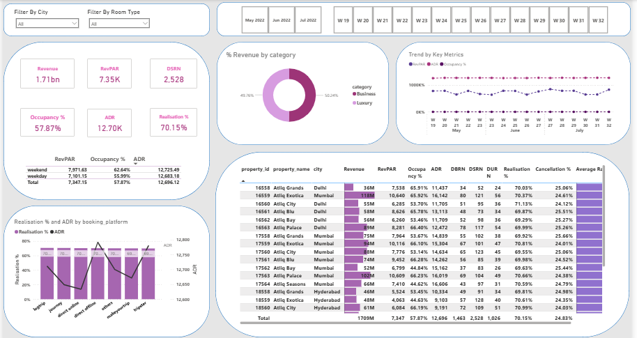

# Power BI Project – Hotel Booking Cancellation Analysis

This is my first Power BI end-to-end dashboard project. I built this while learning Power BI, using a real-world hotel booking dataset to understand the factors affecting booking cancellations.

##  Project Overview

- Tool Used: Power BI Desktop
- Domain: Hospitality
- Dataset: Hotel booking data (CSV format)
- Duration: ~3 hours (guided + hands-on)

##  Key Insights

- Cancellation rates based on room type, lead time, and booking source
- Impact of average daily rate on cancellation
- Trends across weekdays and month-wise booking patterns

##  Skills Applied

- Data cleaning using Power Query
- DAX formulas for KPIs
- Visual storytelling with charts & slicers
- Dashboard design and interactivity

##  Dashboard Preview

This project was built as part of my learning path. The structure is inspired by real-time challenges solved by data analysts.

